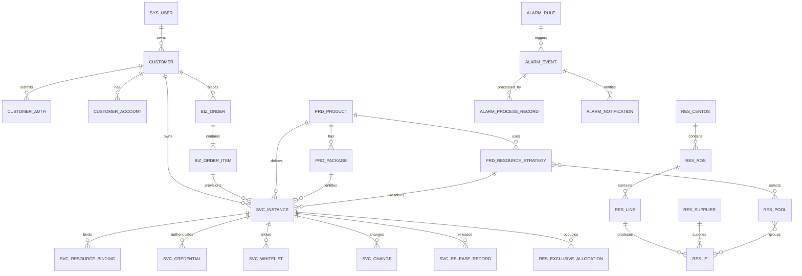

# 核心ER关系

## 关键说明

- `RES_POOL <-> RES_IP` 为多对多；一个IP允许进入多个逻辑池。
- `SVC_RESOURCE_BINDING` 使用 `resource_type + resource_id` 表达多种资源绑定，因此是业务层多态关联，不对每种资源建立数据库外键。
- `MON_OBJECT_STATUS`、`MON_METRIC_SAMPLE`、`ALARM_EVENT` 的监控对象同样采用 `object_type + object_id` 多态引用。
- 产品的五类专项配置分别保存，避免把核心结构完全埋入 JSON。
- 服务实例保存产品、套餐和策略快照，保证历史可追溯。
